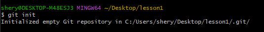
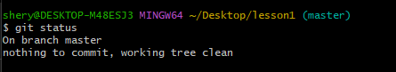
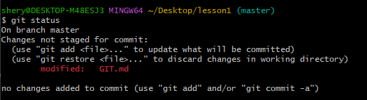
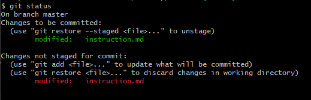
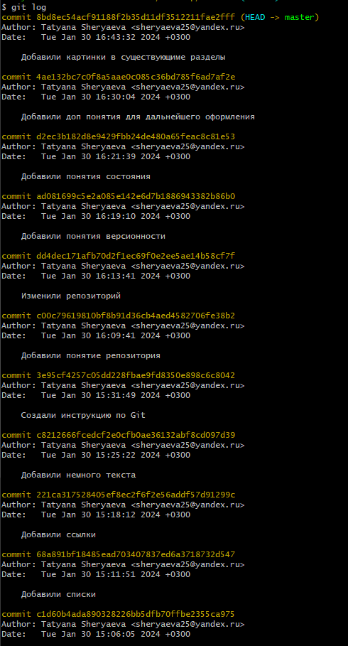
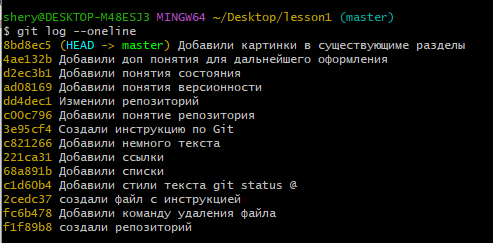

# Подсказка по Git

## Создание репозитория
Репозиторий - это хранилище файлов, поддерживающее версионность. 

**Команда для инициализации локального репозитория:**
```sh
git init
```

## Текущее состояние
Чтобы получить информацию от git о его текущем состоянии, используем команду:
```sh
git status
```
Информация в статусе выводится в нескольких вариантах:

* *Когда изменения не вносились:*

* *Когда изменения были внесены, но не схранены:*


* *Когда часть изменений внесена, сохранена, и мы решили добавить дополнительно информации, вывод будет выглядеть следующим образом:*

## Версионность

Версионность позволяет добавлять файл или файлы к следующему коммиту.

**Команда для добавления файла:**
```sh
git add
```
## Создание коммита
```sh
git commit -m “message”
```
## Вывод общей инфоормации по коммитам

*Вывод на экран истории всех коммитов с их хеш-кодами*
```sh
git log
```
* *Показывает полную историю коммитов*

```sh
git log --oneline
```
* *Показывает сокращенный индекс коммитов для использования перехода между коммитами*


## Перемещение по коммитам

Для перемещения между версиями используется комманды:

* Для перемещения между версиями
```sh
git checkout
```

и

* Для возвращения к последней актуальной версии
```sh
git checkout master
```

## Разница между версиями
```sh
git diff
```
* *Позволяет увидеть разницу между текущим файлом и закоммиченным файлом*


## Добавление веток

Для добавления веток используется команда 

```sh
git branch name_branch
```
Например: